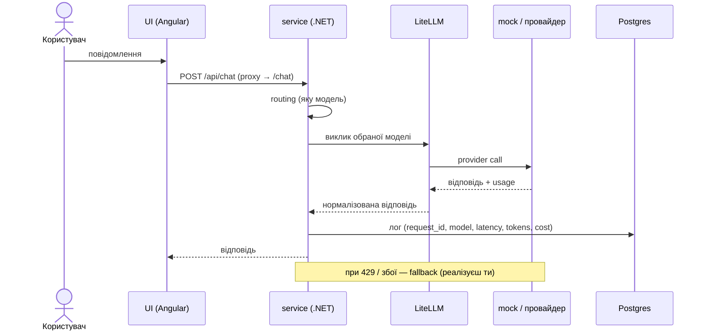

# Getting started — гайд для студента

Це каркас твого capstone — бота підтримки з LLM control plane. Каркас готовий і
запускається однією командою; твоя робота — дописати control plane (routing, fallback,
cost, guardrails, HITL, observability, evals). Нижче — вимоги, запуск і що в кожній папці.

Коротко про поділ праці: **пишеш .NET + конфіг + Python-evals; Angular не чіпаєш — він готовий.**
Уся логіка (control plane) — у `service/`, а LiteLLM просто ходить у провайдерів.

> **Windows:** усі команди курсу виконуй у **Git Bash** (ставиться разом із Git for Windows).
> У PowerShell `curl` — це аліас `Invoke-WebRequest`, а `VAR=x команда` не працює;
> PowerShell-варіанти наведені лише там, де вони справді відрізняються.

> Ще не готував(-ла) машину? Спершу [PREREQUISITES.md](PREREQUISITES.md) —
> перевірка системи, акаунтів і навичок за 15–20 хвилин, до першого уроку.

---

## 1. Вимоги

### Обов'язково (рекомендований шлях — усе в контейнерах)

| Інструмент | Версія | Навіщо |
|---|---|---|
| Docker Desktop **або** Rancher Desktop | Docker Engine 24+, **Compose 2.24+** | піднімає весь стек |
| Git | будь-яка сучасна | клонувати репо |

Перевір: `docker version` і `docker compose version` (саме `compose` без дефіса).

> **Compose має бути 2.24 або новіший — це жорстка вимога, не побажання.**
> `docker-compose.yml` підключає ключі провайдерів через `env_file` з
> `required: false`, а ця форма з'явилася у Compose 2.24.0: на старішій версії
> стек не підніметься взагалі, з помилкою розбору YAML.
>
> Той самий поріг стосується **зсуву портів**.
> Файли `docker-compose.override.yml.example` і `demo-ports.yml` користуються
> тегом `!override`, а він з'явився там же. На старішій версії тег
> **мовчки ігнорується**: порти не заміняться, а **додадуться** — контейнер
> займе і новий порт, і старий, той самий, який ти й хотів звільнити.
> Помилки не буде, стек навіть підніметься. Перевірити, що вийшло насправді:
> `docker compose config` (дивись, скільки записів у `ports`) або
> `docker port <контейнер>`. Compose оновлюється разом із Docker Desktop.
Треба ~4 ГБ вільного місця під образи і ~4 ГБ RAM для контейнерів.

**Вільні порти на хості:** `4200` (UI), `8080` (service), `4000` (gateway), `5432` (Postgres).
Mock-провайдер працює лише всередині docker-мережі, хостовий порт йому не потрібен.
Якщо якийсь порт зайнятий — див. [Troubleshooting](#8-troubleshooting).

### Опційно (лише якщо розробляєш компонент поза контейнером)

- **.NET 8 SDK** — щоб білдити / запускати `service` чи `mock-provider` локально без Docker.
- **Node 20 + npm** — щоб запускати `ui` локально (Angular CLI підтягнеться з `devDependencies`).
- **Python 3.12** — щоб ганяти `evals` з хоста (у стеку і CI окремо не потрібен).

### Реальний ключ провайдера

Для проходження курсу **не потрібен узагалі**: уся обов'язкова доріжка, включно
з тижнем evals, проходиться на **mock — без ключа, безкоштовно**. Єдине місце,
де ключ знадобиться, — **опційний** model-based grader (LLM-as-judge) у hw5,
який не оцінюється. Не купуй ключ заздалегідь «на п'ятий тиждень» — швидше за
все, він тобі не знадобиться.

---

## 2. Швидкий старт

```bash
# ти в корені клону стартера — або свого репо, створеного з нього (§12, крок 0)
docker compose up --build -d
docker compose ps
```

`-d` відправляє стек у фон: термінал лишається вільним, а він знадобиться —
далі всі перевірки йдуть через `docker compose exec` і `curl`. Без нього
доведеться або тримати друге вікно, або гасити стек кожного разу.
`docker compose ps` показує, що піднялося: п'ять сервісів, статус `Up`, порти.

Перший запуск довгий: тягне образи (LiteLLM, Postgres) і білдить .NET + Angular. Далі — швидко.

Що маєш побачити. У `docker compose ps` — усі п'ять сервісів у статусі `Up`.
Angular збирається довше за решту, тож перед тим як іти в браузер, перевір його
окремо (у фоні логів на екрані немає):

```bash
docker compose logs ui | tail -3
```

Має бути `Application bundle generation complete` і `➜  Local:   http://localhost:4200/`.

Відкрий у браузері:

```
http://localhost:4200
```

Побачиш чат «Підтримка». Напиши «Як скинути пароль?» — відповідь піде повним шляхом
UI → service → LiteLLM → mock і повернеться в чат.

> **Якщо перша відповідь — «Сервіс тимчасово недоступний», це не поломка.**
> LiteLLM піднімається довше за решту: контейнер уже в статусі `Up`, а порт
> 4000 ще не приймає. Сервіс чесно повідомляє, що провайдер недоступний.
> Зачекай півхвилини й спитай ще раз. Перевірити напряму:
>
> ```bash
> curl -s -o /dev/null -w "%{http_code}\n" http://localhost:4000/health/liveliness
> ```
>
> `200` — gateway готовий, `000` — ще стартує. Той самий рядок у лозі:
> `docker compose logs gateway | grep "Application startup complete"`.
> У лозі запитів невдала спроба лишиться рядком зі `status = 0` — так і
> задумано: «відповіді не було» відрізняється від «відповідь була помилкою».

**Зупинити:**

```bash
docker compose down        # зупинити стек
docker compose down -v     # + стерти дані Postgres (чистий старт)
```

---

## 3. Структура репозиторію

```
.
├─ docker-compose.yml          # весь стек одним файлом
├─ .github/workflows/
│  └─ eval-gate.yml            # CI: піднімає стек, ганяє evals, блокує regression на PR
│
├─ ui/                         # Angular-чат — ДАЄТЬСЯ ГОТОВИМ, не змінюєш
│  ├─ src/app/app.component.ts #   сам чат-компонент (standalone)
│  ├─ src/main.ts              #   bootstrap застосунку
│  ├─ src/index.html, styles.css
│  ├─ proxy.conf.json          #   dev-proxy: /api → service:8080
│  ├─ angular.json, tsconfig*.json, package.json
│  └─ Dockerfile
│
├─ service/                    # .NET сервіс = CONTROL PLANE — ТУТ ТИ ПРАЦЮЄШ
│  ├─ Program.cs               #   /chat + API-контракт; місця для твого коду позначені TODO(student)
│  ├─ Service.csproj, appsettings.json
│  └─ Dockerfile
│
├─ gateway/                    # LiteLLM — провайдер-адаптер (конфіг, не код)
│  ├─ litellm-config.yaml      #   список моделей: mock, gpt-5-mini, gpt-5, azure
│  └─ .env.example             #   ключі провайдерів (для mock не потрібні)
│
├─ mock-provider/              # фейковий OpenAI-провайдер — ДАЄТЬСЯ ГОТОВИМ
│  ├─ Program.cs               #   канонічні відповіді + інжекція збоїв
│  ├─ MockProvider.csproj
│  └─ Dockerfile
│
├─ db/
│  └─ schema.sql               # таблиці requests, prompts (створюються при старті Postgres)
│
└─ evals/                      # оцінювання якості — ТУТ ТИ ПРАЦЮЄШ
   ├─ run.py                   #   rule-based eval runner
   ├─ golden.jsonl             #   тест-кейси (вхід + очікування)
   └─ requirements.txt         #   stdlib-only
```

### Що робить кожна частина

- **`ui/` (Angular, готове).** Тонкий чат. Ходить у сервіс через dev-proxy `/api` → `service:8080`
  (див. `proxy.conf.json`). Ти його **не змінюєш** — уся твоя робота на бекенді.
- **`service/` (.NET, твоє).** Це control plane. Ендпоінт `/chat` приймає повідомлення,
  обирає модель, кличе LiteLLM, логує в Postgres. Тут ти реалізуєш routing, fallback, cost,
  guardrails, HITL. Ендпоінти `/observability` `/cost` `/prompts` `/providers` `/health`
  `/approvals` — це **API-контракт** для готової консолі; ти наповнюєш їх даними.
- **`gateway/` (LiteLLM).** Єдиний вихід до провайдерів. Ти лише додаєш моделі/провайдерів у
  `litellm-config.yaml`. Рішення (яку модель, коли fallback) приймає **сервіс**, не gateway.
- **`mock-provider/` (готове).** OpenAI-сумісний фейк. Дає безкоштовні детерміновані відповіді
  і вміє на замовлення падати — це основа для reliability і evals без реального ключа.
- **`db/schema.sql`.** Базова схема; ти розширюєш під власні логи/cost/prompt records.
- **`evals/` (твоє).** `run.py` б'є по сервісу кейсами з `golden.jsonl` і рахує, скільки пройшло.
  CI використовує це як гейт: якщо пройшло менше за поріг — merge блокується.

---

## 4. Як усе працює разом



---

## 5. Перевірка, що працює

```bash
# статус контейнерів
docker compose ps

# health сервісу
curl http://localhost:8080/health          # -> {"status":"ok"}

# чат напряму (ASCII, щоб не було проблем із кодуванням у терміналі)
curl -X POST http://localhost:8080/chat \
  -H "Content-Type: application/json" \
  -d '{"message":"please check my order"}'

# SQL до лога (лаби постійно просять SELECT-и) — psql уже є всередині контейнера:
docker compose exec postgres psql -U llmops -d llmops
#   далі звичайний SQL; вихід: \q. Креденшели: llmops/llmops, база llmops
# або одним рядком:
docker compose exec postgres psql -U llmops -d llmops -c "SELECT * FROM requests ORDER BY created_at DESC LIMIT 5;"

# логи
docker compose logs -f service
docker compose logs mock-provider
```

**Опційно: SQL мишею, а не в консолі.** Лаби постійно просять SELECT-и, а в
терміналі широка таблиця ламається по рядках і читається погано. Якщо зручніше
в GUI — постав [DBeaver Community](https://dbeaver.io/download/) (безкоштовний)
чи pgAdmin і підключись до бази стенда:

| Параметр | Значення |
|---|---|
| Host | `localhost` |
| Port | `5432` |
| База | `llmops` |
| Користувач / пароль | `llmops` / `llmops` |

Порт `5432` опублікований у `docker-compose.yml` саме для цього. Якщо клієнт не
під'єднується, найчастіша причина — **свій PostgreSQL, уже встановлений на
машині**: він займає той самий порт, і ти потрапляєш у чужу базу, де таблиці
`requests` просто немає. Тоді або зупини локальну службу, або підніми стенд на
зсунутих портах (`demo-ports.yml`) і вкажи `25432`.

Обов'язковим GUI не є: усі команди в завданнях дано через `psql` у контейнері,
щоб вони працювали в будь-кого без додаткових установок.

> На Windows у Git Bash кирилиця в аргументах `curl` може псуватися. Для перевірки
> української краще користуйся самим чатом на http://localhost:4200 або шли ASCII.
> Але не обмежуйся ASCII: роутинг у курсі ловить **і українські ключові слова** —
> перевіряй обидві мови (українську — через чат/UI); ASCII-only перевірка ховає
> дефект, який побачать реальні користувачі.

---

## 6. Evals і eval-гейт

Eval прогоняє кейси з `golden.jsonl` через сервіс і рахує пройдені.

> **Спершу прогрій стек.** Одразу після `docker compose up` gateway ще холодний:
> перший виклик може впасти — і якщо ти вже зробив fallback (а на тижні 4 —
> тим паче circuit breaker), уся решта кейсів піде у ввічливу заглушку.
> Симптом характерний: **усі** кейси червоні за секунди. Це не регресія промпта,
> а холодний старт. Зроби один-два запити в чат, дочекайся нормальної відповіді —
> і аж тоді прогін. У CI цю роль виконує окремий wait-крок у `eval-gate.yml`.

**Рекомендований спосіб — усередині docker-мережі** (так само, як у CI; оминає хостові
порти й корпоративний проксі):

```bash
docker run --rm --network <project>_default \
  -e SERVICE_URL=http://service:8080 -e PYTHONUTF8=1 \
  -v "$(pwd)/evals:/e:ro" python:3.12-slim \
  python /e/run.py --dataset /e/golden.jsonl --threshold 5
```

`<project>` — префікс мережі (звичайно ім'я папки; глянь `docker network ls`).

**Windows/Git Bash:** команда вище тут не працює — і ламається двічі, причому
друга поломка **тиха**. Без захисту MSYS «перетворює» шлях-аргумент контейнера
(`/e/run.py` → `//E:/run.py` — це видима помилка), а хостовий `$(pwd)`
(`/c/Work/…`) Docker Desktop монтує як **порожню теку** — без жодної помилки
(`can't open file '/e/run.py'`). Робочий рецепт:

```bash
MSYS_NO_PATHCONV=1 docker run --rm --network <project>_default \
  -e SERVICE_URL=http://service:8080 -e PYTHONUTF8=1 \
  -v "$(pwd -W)/evals:/e:ro" python:3.12-slim \
  python /e/run.py --dataset /e/golden.jsonl --threshold 5
```

`MSYS_NO_PATHCONV=1` захищає шляхи-аргументи контейнера, а `$(pwd -W)` дає
Windows-шлях джерела монтування, який Docker Desktop розуміє. Без першого
ламається аргумент (`//E:/run.py`), без другого — тихо монтується порожня тека.

Або з хоста (якщо `8080` вільний і без проксі):

```bash
SERVICE_URL=http://localhost:8080 python evals/run.py --dataset evals/golden.jsonl --threshold 5
```

```powershell
# PowerShell-варіант того самого
$env:SERVICE_URL="http://localhost:8080"; python evals/run.py --dataset evals/golden.jsonl --threshold 5
```

Вихід: `eval: 6/6 passed, threshold 5`, код виходу `0` (green) або `1` (red).

**Як гейт ловить регресію:** сервіс шле system-промпт зі словом «support» → mock віддає
канонічні відповіді → evals зелені. Зламай промпт (прибери «support») → mock почне
відповідати «не знаю» → частина кейсів впаде → пройдено менше за поріг → **гейт червоний**.
Спробуй сам: зміни промпт у `service/Program.cs`, `docker compose up --build -d service`, прожени evals.

---

## 7. Симуляція збоїв (для reliability)

Mock падає на замовлення — двома способами:

- **Маркер у повідомленні** (працює і крізь gateway): напиши в чат/запит `__fail_503`,
  `__fail_429`, `__delay`, `__garbage`.
- **Query до mock напряму** (усередині мережі): `?fail=503`, `?delay=2000`, `?garbage=1`.

На цьому ти будуєш fallback, retry, circuit breaker і graceful degradation.

Повний перелік сценаріїв — які обов'язкові, які розібрані в курсі, і чим кожен
відтворюється — у [`docs/failure-scenarios.md`](docs/failure-scenarios.md).

---

## 8. Troubleshooting

| Симптом | Причина / фікс |
|---|---|
| `project name must not be empty` при `docker compose up` | Тека, з якої запускаєш, має назву з не-ASCII символами (кирилиця) — Compose виводить ім'я проєкту з назви теки й таку не приймає. Клонуй у шлях із латиниці, або задай ім'я явно: `docker compose -p llmops up --build -d`. |
| Чат відповідає «Сервіс тимчасово недоступний» одразу після `up` | LiteLLM стартує довше за решту: контейнер `Up`, але порт 4000 ще не приймає. Зачекай ~30 с. Перевірка: `curl -s -o /dev/null -w "%{http_code}" http://localhost:4000/health/liveliness` має дати `200`. Якщо і за кілька хвилин `000` — дивись `docker compose logs gateway`. |
| `port is already allocated` при `up` | Порт зайнятий іншим процесом. Звільни його або перемап через **локальний override**: скопіюй `docker-compose.override.yml.example` зі стартера в `docker-compose.override.yml` і зміни порти. Увага: Compose **зливає** списки `ports` при мержі — в override перед списком потрібен `!override`, інакше отримаєш обидва мапінги. Override не комітиться (він у `.gitignore`) — CI очікує стандартні порти, і закомічений override завалить крок Wait for service у гейті тижня 6. Після перемапу всі команди цього гайду читай із новим портом. |
| `up` пройшов, а порт поводиться дивно (Windows) | Тихий подвійний бінд: на Windows `up` може **не впасти** при зайнятому порту — на ньому опиняються два слухачі (docker-proxy і чужий процес), і `localhost` / `127.0.0.1` / `[::1]` дають різні відповіді. Перевіряй трійкою: `curl http://localhost:8080/health`, `http://127.0.0.1:8080/health`, `http://[::1]:8080/health` — усі три мають віддати той самий `{"status":"ok"}`; якщо ні — одразу зсувай порти через override. |
| `curl localhost:8080` дає чужу відповідь / 404 | На хості вже щось слухає цей порт (напр. локальний Apache/pgAdmin). Перемап порт (див. перший рядок) або тестуй усередині мережі. |
| Python/скрипт дає 404 на `localhost`, а curl — ок | Різний резолв `localhost` (IPv4/IPv6) або **корпоративний проксі** ганяє `localhost`. Постав `NO_PROXY=localhost,127.0.0.1` або ганяй усередині docker-мережі. Перемикання на `127.0.0.1` допомагає лише якщо на IPv4 сидить саме наш контейнер — при зайнятому порту воно заведе в чужий процес; спершу перевір трійкою з рядка вище. |
| Перший `/chat` повільний або порожній | Gateway (LiteLLM) холодний на першому виклику. Повтори — далі швидко. |
| Кирилиця в `curl -d` перетворюється на `?` | Git Bash на Windows псує non-ASCII в аргументах. Шли через чат/UI, з файлу (`--data @file.json`) або з Linux-контейнера. |
| `ui` не відкривається | Дочекайся `Application bundle generation complete` в `docker compose logs ui`; перший білд Angular довгий. |
| Усі eval-кейси червоні одразу після `up` | Холодний gateway + твій же fallback: перший виклик упав, далі все йде в заглушку (а circuit breaker ще й тримає її). Прогрій одним запитом у чат і повтори прогін. |
| `UnicodeEncodeError` під час прогону evals на Windows | Консоль у cp1252, а у відповідях кирилиця. У стартері `run.py` уже перемикає вивід на UTF-8; якщо пишеш власні скрипти з `print()` — став `PYTHONUTF8=1` або `sys.stdout.reconfigure(encoding="utf-8")`. |
| Змінив `db/schema.sql`, а в базі нічого не змінилося | `schema.sql` виконується **лише при першій ініціалізації** тому Postgres (`docker-entrypoint-initdb.d`). `restart` і навіть `up --build` його не перезапускають. Потрібно `docker compose down -v && docker compose up -d` — тобто стерти том. Це не баг, а стандартна поведінка образу; перевіряй результат через `docker compose exec postgres psql -U llmops -d llmops -c "SELECT name, version, active FROM prompts"`. |
| Треба чистий старт | `docker compose down -v` (стирає дані Postgres), потім `up --build`. |

---

## 9. Що будуєш ти (seam'и)

Шукай `TODO(student)` у `service/Program.cs` — це місця, які дороблюєш:

- **prompt registry** (W1) — промпт із таблиці `prompts` замість хардкоду + версія в лог;
- **routing** (W2) — яку модель обрати під задачу;
- **cost** (W2) — облік токенів і вартості, budget-alert;
- **cache** (W3) — відповідь із кешу замість повторного виклику моделі + лічильники hit/miss;
- **tools** (W3) — виконати `tool_call`, який попросила модель, і підклеїти результат;
- **fallback** (W4) — порядок провайдерів при 429/5xx + graceful degradation;
- **guardrails** (W4) — PII / prompt injection;
- **HITL** (W4) — approval перед незворотною дією (tool-call);
- **API-контракт** — наповнити `/observability` `/cost` `/prompts` `/providers` `/approvals`
  даними для консолі (у стартері вони віддають `{ todo: ... }`, тому плитки показують «—»);
- **evals** (W5) — свої graders і кейси в `evals/`.

Кожен seam підписаний номером тижня: `TODO(student, W2)` тощо — тож видно, що і коли робити.
Усе це, включно з тижнем оцінки якості, проходиться на mock; реальний ключ
потрібен лише для опційного model-based grader'а (hw5, не оцінюється) — див. §1.

---

## 10. C# за п'ять хвилин (якщо пишеш на Python або JS)

Курс не про мову: усе, що ти дописуєш, — це десятки рядків у підписаних місцях.
Але щоб читати `Program.cs` без спотикань, достатньо знати шість конструкцій.

| C# | Що це | Аналог |
|---|---|---|
| `var x = ...;` | змінна з виведеним типом | `x = ...` (Python), `let x = ...` (JS) |
| `async`/`await` | асинхронність | те саме, що в Python і JS |
| `record ChatIn(string Message);` | незмінний об'єкт-контейнер | `dataclass` / `interface` |
| `ConcurrentDictionary<string, string>` | потокобезпечний словник | `dict`, безпечний для паралельних запитів |
| `$"текст {змінна}"` | інтерполяція рядка | f-string / template literal |
| `x?.Y ?? default` | безпечний доступ + значення за замовчуванням | `x.Y if x else default` |

Чотири речі, які виглядають незвично, але нічого не роблять складного:

- **`app.MapPost("/chat", async (ChatIn body) => { ... })`** — це реєстрація
  обробника, як `@app.post("/chat")` у FastAPI або `app.post()` в Express.
  Аргумент `body` розпарсений із JSON автоматично.
- **`Results.Json(new { ... })`** — повернути JSON. `new { a = 1 }` — це
  анонімний об'єкт, тобто просто `{"a": 1}` на виході.
- **`await using var db = new NpgsqlConnection(conn);`** — з'єднання з базою,
  яке саме закриється в кінці блоку (як `with` у Python).
- **Top-level statements**: `Program.cs` — файл без класу, тому поля й константи
  класу в ньому оголошувати не можна (компілятор дасть `CS0106`) — спільний стан
  виноситься у `static class`. Локальні функції пиши **після** statements, але
  **до** оголошень типів (`record` тощо), інакше отримаєш `CS8803`.

Компілювати руками не потрібно: `docker compose up --build` збирає сервіс у
контейнері. Якщо хочеться підсвітки й переходу до визначення — відкрий папку
`service/` у VS Code з розширенням C# Dev Kit, але для курсу це не обов'язково.

### Як додати юніт-тести (згадуються в hw3–hw4)

У стартері тестового проєкту немає — коли ДЗ радить юніт-тест, заведи його за
п'ять команд (потрібен .NET SDK з розділу «Опційно» §1):

```bash
# --framework net8.0 обов'язковий: без нього шаблон візьме дефолтний TFM
# твого SDK (напр. net10), і тест-збірка не зматчиться із сервісом на net8
dotnet new xunit -o tests --framework net8.0
dotnet add tests/tests.csproj reference service/Service.csproj
# винеси функцію під тест у public static class (див. нижче), потім:
dotnet test tests
```

Головна пастка: **функції, оголошені прямо в top-level `Program.cs`, невидимі
для тест-збірки** (це локальні функції автозгенерованого Main). Функцію під
тест (наприклад, `MaskPii`) винеси в окремий файл-клас:

```csharp
// service/Guards.cs
public static class Guards
{
    public static string MaskPii(string s) =>
        System.Text.RegularExpressions.Regex.Replace(s, @"[\w.\-]+@[\w.\-]+", "[email]");
}
```

і виклич із `Program.cs` як `Guards.MaskPii(...)`. Тест тоді звичайний:
`Assert.Equal("мій email [email]", Guards.MaskPii("мій email a@b.com"));`.
Це рекомендований додаток, а не обов'язкова інфраструктура: обов'язкові
перевірки ДЗ сформульовані так, щоб проходитися поведінково і рев'ю коду.

---

## 11. Перемикання на реальний ключ

За замовчуванням усе на mock (безкоштовно, без ключа). Коли захочеш реальну модель:

1. `cp gateway/.env.example gateway/.env`
2. впиши `OPENAI_API_KEY=...` (і/або Azure-змінні) у `gateway/.env`
3. підніми стек з реальною моделлю:

```bash
MODEL=gpt-5-mini docker compose up --build
```

Сервіс бере модель зі змінної `MODEL` (див. `service/Program.cs`), LiteLLM підставляє ключ
із `gateway/.env`. Повернутися на mock — звичайний `docker compose up` без `MODEL`.

Ім'я файлу має бути рівно `gateway/.env`: саме його підключає `env_file` у
`docker-compose.yml`, і саме тому ключ бачить **лише** gateway, а не сервіс.
Перевірити, що ключ доїхав до контейнера, до того як витрачати запити:

```bash
docker compose config | grep -c OPENAI_API_KEY
```

`1` — ключ доїхав, `0` — ні: або файл названо інакше, або лежить не в
`gateway/`. Рахуємо, а не друкуємо: `docker compose config` показав би значення
ключа відкритим текстом. Сам файл у `.gitignore`, у репозиторій не потрапить.

Два попередження перед перемиканням:

- **Додай ціну нової моделі у прайс сервісу** (табличка цін із W2), інакше
  `cost_usd` стане `null` — і тижні 2/5 залишаться з мертвою вартістю.
- Роутер зі стартовою логікою на реальному ключі **вироджується**: його
  ключові слова підібрані під mock-сценарії (див. урок 3) — перевір і онови
  маршрути під реальні відповіді.

Що змінюється: на mock відповіді детерміновані (демо + структурні тести), на реальній
моделі — справжня якість, багатоходовий контекст і model-based evals (LLM-as-judge).
Rule-based evals і весь інженерний core однакові в обох режимах.

---

## 12. Здача домашок і перевірка

### Крок 0 (один раз): свій репозиторій зі стартера

Стартер живе в окремому репозиторії, і його корінь — це вже те, що має стати
коренем твого: там лежить `.github/workflows/eval-gate.yml`, а GitHub бачить
workflows лише в корені. Форк не потрібен — потрібна власна історія з нуля.
GitLab у команді нижче — **лише джерело стартера**; свій репозиторій створюй
на GitHub. CI-гейт тижня 6 (`eval-gate`, блокує merge на регресії evals)
написаний під GitHub Actions — на GitLab він не запуститься.
Один раз зроби так:

```bash
# 1) створи на GitHub порожній репозиторій, наприклад llmops-bootcamp-my
# 2) візьми стартер і зроби його своїм
git clone https://gitlab.com/taras_fedorenko/llmops-bootcamp-starter.git my-bootcamp
cd my-bootcamp
rm -rf .git
git init -b main && git add -A && git commit -m "start: llmops-bootcamp starter"
git remote add origin https://github.com/<ти>/llmops-bootcamp-my.git
git push -u origin main
```

`rm -rf .git` тут не випадковий: він відрізає історію стартера, щоб твої коміти
починалися з чистого аркуша, а `origin` не тягнувся за старим репозиторієм.

Перевір себе: з кореня твого репо працює `docker compose up --build`, а на
першому ж PR у вкладці Actions запускається `eval-gate`.

Важливо розуміти навіщо: це **твій** репозиторій, а не «здача в чужу систему».
Усі 6 тижнів ти накидуєш рішення в нього — і після курсу він **залишається
тобі**: зібраний власноруч production-проєкт із CI-гейтом і живою консоллю,
який не соромно показати в портфоліо і розібрати на співбесіді.

### Студент здає

1. Гілка + Pull Request у своєму репозиторії (створеному в кроці 0).
2. На PR запускається CI (`.github/workflows/eval-gate.yml`): піднімає стек, ганяє evals і
   **червоніє, якщо пройдено менше за поріг** (регресія).
3. В описі PR: що реалізовано цього тижня + скрін консолі (які плитки/картки ожили).

### Ментор перевіряє

> Процес, глибина перевірки (коли обов'язково піднімати стек, а коли достатньо
> артефактів PR), критерії повернення, час і формат фідбеку — у гайді ментора
> (ментор отримує його окремо; критерії прийому відкриті в кожному ДЗ тижня).
> Тижневий чек-лист — нижче.

### Чек-лист прийняття по тижнях

- **W1** — стек піднявся; кожен запит у таблиці `requests`; реєстр `prompts` наповнений із міграції (дві версії, одна active); промпт версіонується і версія їде в лог.
- **W2** — routing обирає різні моделі; є `cost_usd`; консоль показує Вартість/бюджет.
- **W3** — повторний запит віддається з кешу (у свіжому рядку `requests` токени і `cost_usd` нульові — повтор не ходив у модель); tool-виклик виконується; timeout та ключ ідемпотентності описані в PR (реалізація — опційна доріжка).
  (Лічильники hit/miss стають видимими в консолі лише на W5 — на W3 їх достатньо мати в коді.)
- **W4** — при падінні провайдера спрацьовує fallback; незворотна дія — через approval (`/approvals`).
- **W5** — консоль показує p95/error-rate і статус провайдерів; golden dataset розширений власними кейсами, поріг оновлений за правилом із hw5.
- **W6** — CI-гейт блокує регресію; демо інциденту (outage → fallback → recovery).

Мінімальна планка кожного тижня: deliverable піднімається `docker compose up` і його видно
в чаті/консолі або в evals. Нічого «в стіл» — усе в працюючій системі.
